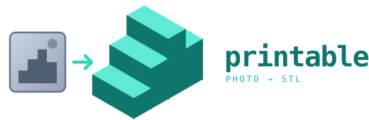

<p align="center">
  
</p>

<p align="center">
  <strong>Turn a photo into a 3D-printable STL.</strong><br>
  Four backends behind one interface. Everything that comes out is watertight, scaled in millimetres, and validated against your printer.
</p>

<p align="center">
  <a href="#quick-start">Quick start</a> ·
  <a href="#setup">Setup</a> ·
  <a href="#backends">Backends</a> ·
  <a href="#how-it-works">How it works</a> ·
  <a href="docs/SETUP.md">GPU setup</a>
</p>

---

Most image-to-3D tools stop at "here is a mesh." That mesh usually will not
slice: holes, non-manifold edges, floating debris, arbitrary scale. `printable`
treats generation as one stage of a pipeline whose job is a file your slicer
accepts — repair, print prep, and a validation gate that fails loudly rather
than handing you a broken STL.

Two of the four backends need no GPU at all, so you can print something before
downloading a single model weight.

## Quick start

```bash
git clone https://github.com/seehiong/printable.git
cd printable
uv sync
source .venv/bin/activate   # Windows: .venv\Scripts\activate

printable generate assets/examples/character.png --backend lithophane --size 120
```

That produces a printable lithophane in a few seconds, CPU only. Open the STL
in your slicer and it will load without repair.

## Setup

### Requirements

| | |
|---|---|
| **Python** | 3.10 or newer |
| **OS** | Linux, macOS, or Windows. GPU backends are best on Linux. |
| **Disk** | ~200 MB for the base install; 5–30 GB more per AI model |
| **GPU** | Not needed for `lithophane` / `heightmap`. See below for the rest. |

### Base install

```bash
uv sync
```

This pulls in `numpy`, `trimesh`, `pillow`, `scipy`, plus four dependencies
that trimesh treats as optional but this pipeline genuinely needs:

- **`networkx`** — trimesh's mesh splitting and winding repair
- **`rtree`** — spatial indexing for proximity queries
- **`fast-simplification`** — backs quadric decimation; without it `--max-faces`
  silently does nothing, which matters a lot for AI meshes
- **`manifold3d`** — the boolean backend. `--add-base` and `--hollow` are
  booleans and the base is on by default, so without it the base fails to union
  and the STL exports as several disconnected bodies

Verify:

```bash
printable backends
```

```
  ok  heightmap    cpu   ok
  --  hunyuan3d    gpu   torch not installed
  ok  lithophane   cpu   ok
  --  triposr      gpu   torch not installed
```

`--` is not an error. It means that backend's upstream repo is not installed
yet, and the CLI tells you exactly what is missing rather than failing at
generation time.

### Optional extras

```bash
uv sync --extra repair --extra preprocess   # or --all-extras for both
```

`pytest` and `ruff` are in the `dev` dependency group, which `uv sync` installs
by default (pass `--no-dev` to skip it). Note that `uv sync` re-syncs the
environment to match the flags on that invocation, so pass every extra you
want together rather than running separate `uv sync --extra ...` calls.

**`repair`** adds Poisson surface reconstruction, the last-resort rebuild for
meshes nothing cheaper can close. Worth having before you run AI backends.

**`preprocess`** adds `rembg` for photo background removal. Note that a flat
studio backdrop does not need it — the built-in `key_background=true` option
handles those deterministically, with no model download. `rembg` is for busy
real-world photo backgrounds. It depends on `onnxruntime`, whose native library
fails to load on some Windows setups; if you hit that, it is usually a missing
Visual C++ redistributable.

### GPU backends

Each AI backend wraps an upstream research repo that must be installed
separately — they carry heavy, mutually incompatible pins, so adapting to them
beats vendoring them.

**[docs/SETUP.md](docs/SETUP.md) has the full instructions**, including ROCm on
AMD Strix Halo (Ryzen AI Max+), which needs specific attention: BIOS memory
allocation, the `gfx1151` architecture override, and which CUDA-specific pieces
(flash-attn, spconv, nvdiffrast) need substitutes.

Short version:

```bash
# NVIDIA
uv pip install torch torchvision

# AMD ROCm - match your system's actual ROCm version (`hipconfig --version`),
# not an arbitrary one; a mismatch causes native extensions built later to
# fail with an `undefined symbol` ImportError rather than an obvious error.
uv pip install --index-url https://download.pytorch.org/whl/rocm7.1 torch torchvision

# Confirm the GPU is visible (ROCm reports through the CUDA API)
uv run --no-sync python -c "import torch; print(torch.cuda.is_available())"
```

Then install whichever model you want — TripoSR is the one to try first, since
it has the fewest exotic dependencies and proves your accelerator stack works.

**On ROCm, `hunyuan3d` generation needs `TORCH_ROCM_AOTRITON_ENABLE_EXPERIMENTAL=1` set** —
without it, generation fails partway through with `error: No available kernel. Aborting execution.`
(PyTorch's attention dispatcher, not a `printable` bug). Not needed on NVIDIA. Prefix any
`hunyuan3d` command with it on ROCm:

```bash
TORCH_ROCM_AOTRITON_ENABLE_EXPERIMENTAL=1 printable generate figure.jpg -b hunyuan3d --size 80
```

**Once a GPU backend is installed, avoid bare `uv sync` and bare `uv run
<anything>`** (`uv run pytest`, `uv run ruff check`, all of them) — both
reconcile the venv to match `printable`'s own lockfile by default, which
silently *removes* torch and everything installed on top of it, since none
of that is in the lockfile. To run a command, use `uv run --no-sync
<command>`, or just call the activated venv's binaries directly with no
`uv run` prefix at all. To add a new extra (e.g. `--extra api`), use `uv
sync --extra X --inexact` — `--inexact` stops removal of packages outside
the lockfile, though it does *not* protect the *version* of already
lockfile-tracked packages if the new extra needs a newer one (rare; none of
this project's extras do today). See [docs/SETUP.md](docs/SETUP.md) for the
full explanation and recovery steps if you get bitten by this.

### VRAM guide

| Backend | VRAM | Notes |
|---|---|---|
| `triposr` | ~6 GB | Runs on CPU too, slowly |
| `hunyuan3d` mini | ~8 GB | `--opt subfolder=hunyuan3d-dit-v2-mini` |
| `hunyuan3d` full | ~16 GB | Shape model only |

Unified-memory machines (Apple Silicon, Strix Halo) can allocate well past
these figures and run everything at full precision.

## Backends

| Backend | Hardware | Output | Speed |
|---|---|---|---|
| `lithophane` | CPU | Backlit relief plate | seconds |
| `heightmap` | CPU | Bas-relief | seconds |
| `triposr` | GPU | True 3D | ~10s |
| `hunyuan3d` | GPU | True 3D | ~1 min |

The CPU backends are not a consolation prize. A lithophane — dark areas printed
thick so the image appears when backlit — is a genuinely good thing to print,
and it exercises the whole pipeline without a model download.

The GPU backends infer the *whole* object from one view, which means they invent
the half you cannot see. That is inherent to single-image reconstruction, not a
defect. If you can take 30+ photos, photogrammetry (COLMAP, Meshroom) will beat
any of these on accuracy.

**Translucent or sheer material is the hardest case, worse than the missing-back
problem above.** `assets/examples/figure_medusa_scale_statue.jpg` is a real
example: flowing semi-transparent fabric wings and crystal formations came out
of `hunyuan3d` as a flat, featureless slab where the fine lattice detail used to
be. Two compounding reasons, not one bug: background removal (`u2net`) is
trained mostly on opaque subjects, so a translucent region with soft, low-contrast
edges against the backdrop often gets stripped out or kept as a shapeless blob
rather than segmented cleanly; and even with a perfect mask, single-image 3D
reconstruction models — trained mostly on solid, everyday objects — tend to
flatten fine lace-like or sheer geometry rather than reproduce it. No flag here
fixes this (`key_background=true` is a flat-color deterministic keyer, wired up
for `heightmap`/`lithophane` only, not the GPU backends). For a subject built
mostly from opaque material this is a non-issue; for one built mostly from sheer
fabric, glass, or crystal, expect a simplified result and pick a different photo
if you need the fine detail to survive.

## Usage

`hunyuan3d` examples below need `TORCH_ROCM_AOTRITON_ENABLE_EXPERIMENTAL=1`
prefixed on ROCm — see "GPU backends" above.

```bash
# Lithophane with a border frame
printable generate assets/examples/portrait.jpg -b lithophane --size 120 \
  --opt frame_mm=3 --opt max_thickness_mm=3.2

# Bas-relief with the background cut away
printable generate assets/examples/character_male.png -b heightmap --size 90 \
  --opt key_background=true --opt relief_mm=7

# True 3D, fast preview -- ~10s on GPU, also runs (slowly) on CPU.
# texture=true additionally writes a colored .glb preview next to the STL.
printable generate assets/examples/character_male.png -b triposr --size 90 \
  --opt texture=true

# True 3D, hollowed to save filament (ROCm: prefix with
# TORCH_ROCM_AOTRITON_ENABLE_EXPERIMENTAL=1, see above). --max-faces raised
# above this backend's raw output size (~400k faces on this example) --
# decimating down to the 300k default introduced non-manifold edges here,
# and the repair ladder's Poisson-rebuild escalation didn't recover
# watertightness afterward; see ROADMAP.md's Known Limitations
printable generate assets/examples/figure.jpg -b hunyuan3d --size 80 --hollow --hollow-wall 1.6 --max-faces 500000 --no-base

# Character turnaround sheet: split, generate from every panel, keep the
# one that's actually printable
printable generate assets/examples/character_female_turnaround.png -b hunyuan3d --size 80 --sheet

# Check an existing mesh without regenerating
printable inspect model.stl --size 100
```

**Multi-view sheets need splitting first.** A turnaround packs several views
into one image; fed whole to an AI backend, the model reconstructs all the
figures as a single mass, not one clean subject. `printable generate --sheet`
handles this: it splits the sheet (finding the real seams, not just even
quarters), runs the *full* pipeline on every panel, and keeps whichever
result actually comes out watertight with the fewest disconnected bodies —
add `--keep-all` to also export every panel's attempt
(`<output>_v0.stl`, `_v1.stl`, ...) if you want to compare them yourself.

This picks by real validation results on purpose, not by how well-framed a
panel looks. These backends infer a whole shape from *one* image — there's
no multi-view fusion mode that combines all four panels — and which single
view reconstructs well depends on things a 2D crop can't tell you (mainly:
whether the subject is facing the camera). A back view can be perfectly
centred and still reconstruct into a fragmented mess; only actually running
generation on it reveals that. `printable split assets/examples/character_female_turnaround.png -d panels/`
still exists on its own if you just want the cut panels without generating
from all of them.

Printer constraints are first-class flags — `--size`, `--nozzle`, `--min-wall`,
`--max-overhang`, `--build-volume` — and backend-specific settings go through
repeatable `--opt key=value`.

**Auto-orient optimizes purely for print success (max bed contact, min
overhang) — it has no concept of "feet down" for a character mesh.** It no
longer swaps top for bottom on a whim (fixed — see ROADMAP.md's Known
Limitations for the details; both `assets/examples/character_male.png` via
triposr and `figure.jpg` via hunyuan3d now stand correctly on their own,
verified visually), but it can still lay a standing figure on its side if
that genuinely wins on flat contact area, and a case where a backend's raw
output is itself upside-down would still need help. Check the result
before assuming it needs fixing. If it genuinely doesn't, `--rotate X Y Z`
(degrees, applied after auto-orient and before the base is added — unlike
rotating the finished STL in a slicer, this actually moves the base to the
new bottom face) corrects it — use whatever rotation the mesh you're
looking at actually needs, not a guessed value:

```bash
# ROCm: prefix with TORCH_ROCM_AOTRITON_ENABLE_EXPERIMENTAL=1, see "GPU backends" above
printable generate your_image.jpg -b hunyuan3d --size 80 --rotate 180 0 0
```

### Useful options

| Option | Backends | What it does |
|---|---|---|
| `key_background=true` | heightmap, lithophane | Cut a flat backdrop away so it does not become geometry |
| `max_dim=N` | heightmap, lithophane | Source resolution; controls mesh density at the source |
| `relief_mm=N` | heightmap | Height of the relief above the base |
| `gamma=N` | lithophane | Tone curve; 2.2 is a good starting point |
| `steps=N` | hunyuan3d | Diffusion steps; more is slower and finer |
| `octree_resolution=N` | hunyuan3d | 256 default, 384 for finer detail at more memory |
| `geometry_cues=true` | any | Writes `<output>_depth.png` / `_normal.png` for inspection. Diagnostic only — see docs/SETUP.md |
| `texture=true` | triposr | Writes a colored `<output>.glb` preview alongside the STL (cheap per-vertex color; see docs/SETUP.md) |

STL has no color, so `--opt texture=true` on triposr additionally writes a
`.glb` next to the STL — a colored preview captured right after generation,
before repair/print-prep, since decimation, Poisson rebuild, and the
hollow/base booleans all silently drop color. The `.glb` is for looking at,
not printing; the `.stl` stays the print target. `printable serve`'s own
web UI renders it automatically alongside the STL, or drag it into Blender
or any glTF-aware viewer. hunyuan3d doesn't support `texture=true` yet — it
would need a separate, much more expensive texture-bake pass; see
docs/SETUP.md for what that would take.

## Design spec sheets

A design spec sheet is one image carrying everything a normal photo
doesn't: labeled multi-view renders, dimension callouts, print
recommendations — `assets/examples/keychain_boba_spec.jpg` is a real
example (front/back/side views, `60mm` height, `30mm` width, wall
thickness, keyring loop, print settings, all in one JPG). Two commands,
two separate steps:

```bash
# 1. Extract -- design_spec.json + view crops, no generation, no backend needed
printable generate-spec assets/examples/keychain_boba_spec.jpg

# 2. Generate -- try every extracted view, keep whichever is actually most
# printable (--sheet's approach, applied to the spec's own crops); auto-fills
# --size/--min-wall from the spec, and checks the result's proportions against it
TORCH_ROCM_AOTRITON_ENABLE_EXPERIMENTAL=1 printable generate \
  --spec interim/design_spec.json --spec-all-views -b hunyuan3d
```

Step 1 needs the HTTP client extra (`uv sync --extra spec`, or `--inexact` if GPU backends
are installed) and an external VLM extraction server — **not** something `uv
sync` installs, and not vendored in this repo. It's any HTTP service
exposing `POST /extract` (multipart image in, the `design_spec.json` shape
out — see `src/printable/vlm_client.py`), reachable at `--vlm-url`
(default `http://localhost:8082`). On the machine this was built and
tested on, that's **two separate processes, started in order** — a thin
FastAPI proxy that does no model loading itself, sitting in front of the
actual model server:

```bash
# 1. The model itself -- must be running first, this is what actually
#    holds Qwen3.8-27B in memory. Exact launch command (and why --ctx-size
#    is sized this way) is in ROADMAP.md's "Confirmed fix for the OOM
#    crashes" section.
llama-server-rocm --model ... --mmproj ... --host 0.0.0.0 --port 8080

# 2. The thin proxy -- an HTTP client against step 1's :8080, nothing more.
#    Starting this alone without step 1 already running just gets you
#    connection errors on every /extract call.
bash ~/vlm-server/run.sh   # foreground, leave it running
```

Both scripts and the servers they run live outside this repo
(machine-specific infrastructure, not code this project ships) — see
`ROADMAP.md`'s "Confirmed fix for the OOM crashes" section for the actual
reference `llama-server-rocm` launch command and why `--ctx-size`
specifically is sized the way it is (the one flag with real project-specific
reasoning behind it; the rest are standard `llama-server`/`llama.cpp`
options, see upstream's own docs for those), and its Phase 1 for the
model-choice history (why the GGUF/`llama.cpp` vision path needed
`Qwen2.5-VL` on `transformers` first, then moved to `Qwen3.8-27B` on
`llama-server-rocm` once that stopped hitting the same ROCm bug) if you're
setting up your own.

**Multi-view extraction is unreliable in practice.** The metadata fields
(`dimensions_mm`, `print_constraints`) extract accurately, but locating and
correctly labeling more than one view's bounding box on a busy sheet is a
real, current limitation of the VLM this was tested against — expect
`views` to often contain only one entry, and don't assume a same-named
crop (`back.png`, `side.png`) is actually that view. This has turned out
not to matter much: no backend here fuses multiple views into one
reconstruction anyway, so `--spec-all-views` just tries whatever crops it
got as independent single-image candidates and keeps the best result —
correct labeling was never load-bearing for STL quality, only crop
completeness is.

Once you have `interim/design_spec.json` and its view crop(s), `printable
generate --spec <path>` reuses them freely — different backend, different
`--rotate`, different `--tolerance` — without calling the VLM server again.
For quick iteration, generate from one already-chosen crop directly instead
of paying for the full set every time:

```bash
printable generate interim/front.png --spec interim/design_spec.json -b triposr
```

## Web API

```bash
uv sync --extra api --inexact   # --inexact: see "Once a GPU backend is installed" above

# ROCm: needs TORCH_ROCM_AOTRITON_ENABLE_EXPERIMENTAL=1 prefixed too, same as
# any hunyuan3d CLI run (see "GPU backends" above) -- unlike the CLI, this is
# a long-lived server process, so the env var has to be set once here at
# launch, not per command. Skipping it doesn't fail until the first
# hunyuan3d job actually runs, with a raw `RuntimeError: No available
# kernel. Aborting execution.` traceback in the server log and a generic
# "generation failed" in the UI -- easy to hit without realizing why, since
# auto-detect (below) routes almost everything except portraits into
# hunyuan3d first.
TORCH_ROCM_AOTRITON_ENABLE_EXPERIMENTAL=1 printable serve --host 0.0.0.0 --port 8000
```

Runs the same pipeline behind a small FastAPI server with a browser UI —
upload a photo from any device on the LAN, watch the pipeline run stage by
stage (background removal, generation, repair, prep, validate, export) over
Server-Sent Events, then view and download the resulting STL — or, with the
"Color (GLB)" option checked, a colored GLB preview instead. Open
`http://<this-machine's-lan-ip>:8000/` from another PC once it's running;
`--host 0.0.0.0` (the default) is what makes it LAN-reachable rather than
localhost-only.

**Auto-detect** (the checkbox above the manual controls) classifies the
upload with the same external VLM server the "Design spec sheets" section
above uses, then routes it to whichever existing pipeline fits — no backend
picked by hand:

| classified as | routes to |
|---|---|
| design spec sheet (dimension callouts, print settings) | spec extraction, same as `--spec` |
| character turnaround (multiple views, no callouts) | grid-split-and-pick-best, same as `--sheet` |
| portrait photo | lithophane |
| photo of a single object | hunyuan3d (falls back to triposr) |
| unclear | no mesh generated — the job finishes with the classification shown so you can pick a backend manually instead |

The decision (category, a one-sentence rationale, chosen backend) shows up
in the progress panel as soon as classification finishes, before generation
starts — this is what makes `--sheet`'s multi-panel workflow reachable from
the web UI at all today; there's still no manual sheet-mode toggle here, so
use the CLI directly if you want to force it rather than let auto-detect
decide. Same VLM-server requirement and the same multi-view-crop caveat from
"Design spec sheets" above apply when it routes into the spec pipeline.

Jobs run one at a time — GPU backends share one accelerator and cannot
generate concurrently — and are tracked in memory only, so a server restart
drops job history. There's no authentication, so only run this on a network
you trust.

**On ROCm, switching which GPU backend a job uses mid-process is an open
risk** — confirmed on one box to hang the entire machine, not just the
server. See docs/SETUP.md's Troubleshooting section before running jobs
against more than one GPU backend on the same long-lived `printable serve`
process; restarting the server between different-backend jobs is the safe
option until this is root-caused.

## How it works

```
photo
  → background removal        AI backends; the biggest quality lever
  → geometry generation       backend of choice
  → repair                    watertight, manifold, no floating islands
  → print prep                scale to mm, orient, seat on bed, base, hollow
  → validate                  overhangs, thin walls, build volume, adhesion
  → STL
```

**Repair matters more than model choice.** The ladder escalates cheapest-fix
first — basic clean, island removal, hole filling — and only reaches for Poisson
reconstruction, which costs sharpness, when nothing else closes the mesh. It
distinguishes open edges from non-manifold edges, because they need different
repairs and hole filling silently does nothing for the latter.

**Print prep** searches candidate orientations, scoring by support area needed
against base contact, then seats the model on the bed and optionally adds a base
or hollows the interior.

**Validation** is a gate, not a report. Exit code is 0 when printable, 1
otherwise, so it drops into a script:

```
  watertight           True
  bodies               1
  extents_mm           [105.0, 105.0, 4.0]
  volume_cm3           36.54
  base_contact_mm2     11025.0
  overhang_fraction    0.0
  est_filament_g       6.8

  [WARNING] thin_features: 24% of sampled interior is thinner than 0.8mm

  PRINTABLE
```

Errors mean it will not slice. Warnings mean it will slice but may not print
well.

## Development

```bash
uv sync --inexact   # see "Once a GPU backend is installed" above
uv run --no-sync pytest -q
uv run --no-sync ruff check src/ tests/
```

Same rule as above: `--inexact`/`--no-sync` on every command here is
deliberate, not optional, once a GPU backend is installed. Harmless either
way (skips a redundant sync/reconcile once the venv already matches), so
there's no reason not to always use it.

The test suite runs on CPU with no model weights and pins the behaviours that
are easy to regress:

- **Lithophane inversion** — dark must print thicker, or the image reads as a
  photographic negative when lit
- **Watertightness through decimation** — quadric simplification can create
  non-manifold edges; the repair ladder has to close them
- **Flat bottoms are not overhangs** — a part's underside points straight down
  but rests on the bed; counting it reported every flat model as half overhang
- **Background keying under a lighting gradient** — a single flat-colour key
  matches one end of a gradient backdrop and misses the other

## Licence

MIT — see [LICENSE](LICENSE).

The example images in [assets/examples/](assets/examples/) were generated with Stable Diffusion; see the [notes there](assets/examples/README.md) for provenance and why the character sheet makes a useful test case.
