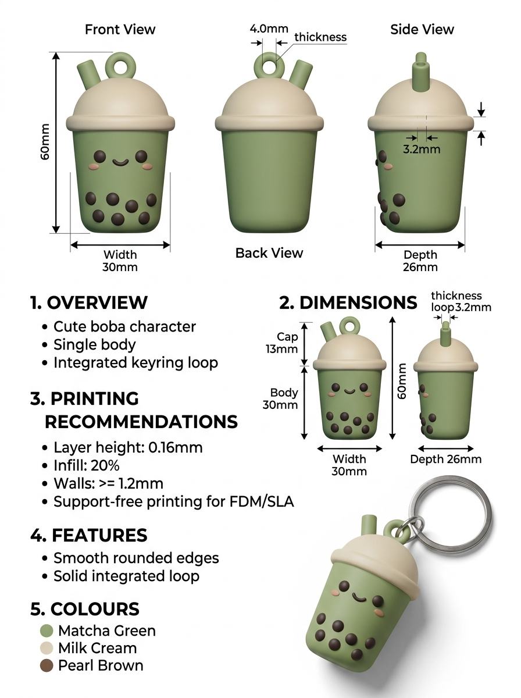

# Printable Roadmap: Intelligent Spec-to-3D Pipeline

This document outlines the architecture and milestones for evolving `printable` from single-photo reconstruction into an intelligent, **spec-driven 3D generation and validation pipeline** capable of parsing engineering infographics, multi-view design sheets, and dimensioned blueprints.

---

## 1. Problem Statement & Motivation

Generative image-to-3D backends (such as Trellis, TripoSR, or Hunyuan3D) expect clean, unannotated photos of a single subject. When provided with a **design specification sheet** (containing text callouts, dimension arrows, orthographic front/back/side views, color swatches, and keychain mockups), raw 3D models fail:
- Text and dimension lines become noisy, distorted geometry.
- Multiple renders are fused into an unrecognizable blob.
- Explicit physical constraints (such as an exact 60 mm height or a 4 mm loop hole) are ignored.

By introducing a **local Multimodal / Vision-Language Model (VLM)** preprocessor, `printable` will understand the design intent, crop clean views, extract physical constraints into structured metadata, and enforce those rules during generation and slicer validation.

---

## 2. System Architecture

```
                                [ Design Spec Sheet ]
                                         │
                                         ▼
                 ┌───────────────────────────────────────────────┐
                 │  Stage 1: VLM Extraction (Qwen3.8-27B, via     │
                 │  resident llama-server-rocm's HTTP API)        │
                 │   - Metadata: dimensions + print constraints   │
                 │   - Per-view bounding box detection            │
                 └───────────────────────┬───────────────────────┘
                                         │
                         ┌───────────────┴──────────────┐
                         ▼                              ▼
             [ interim/design_spec.json ]   [ interim/cropped_views/ ]
             - Target dimensions (X/Y/Z mm) - front_clean.png
             - Wall thickness, loop sizes   - side_clean.png
             - Infill / layer height specs  - back_clean.png
                         │                              │
                         └───────────────┬──────────────┘
                                         ▼
                 ┌───────────────────────────────────────────────┐
                 │   Stage 2: Constraint-Driven 3D Generation    │
                 │   - Per-view candidates (Hunyuan3D / TripoSR) │
                 │   - Automated CLI param injection (--size...) │
                 └───────────────────────┬───────────────────────┘
                                         │
                                         ▼
                 ┌───────────────────────────────────────────────┐
                 │   Stage 3: Repair & Verification Gate         │
                 │   - Watertight repair + manifold check        │
                 │   - Spec tolerance check (target mm vs actual)│
                 │   - Keyring loop hole passability check       │
                 └───────────────────────┬───────────────────────┘
                                         │
                                         ▼
                               [ Validated STL File ]
```

---

## 3. Milestones & Phases

### Phase 1: Local VLM Integration

**Superseded twice since this was first written -- kept short here on
purpose, the full story is told better in the project's own blog post
("Vision-Language Models: What They're Actually Good At").** Three
model/stack combinations were tried in sequence, not one:

1. **Qwen2.5-VL-7B-Instruct via `llama-server-rocm` (GGUF)** -- blocked by
   a real ROCm/HIP FP16 matmul correctness bug that garbles any image
   input on this chip
   ([ggml-org/llama.cpp#17797](https://github.com/ggml-org/llama.cpp/issues/17797)),
   confirmed via live testing (text-only chat clean, any image request
   comes back as multi-language token soup) and confirmed present on this
   box's exact build despite the linked upstream fix already being merged
   into it.
2. **Qwen2.5-VL-7B-Instruct via `transformers`/PyTorch** -- sidesteps that
   bug (a completely different compute stack), confirmed working with
   clean extraction against `keychain_boba_spec.jpg`. This is what
   `~/vlm-server/` was originally built around.
3. **Qwen3.8-27B via `llama-server-rocm`'s HTTP API** -- what's actually
   running today. Switched because Qwen2.5-VL, once multi-view
   bounding-box extraction was exercised at scale, hit a second,
   separately upstream-documented bug (correct box for the first
   requested region, drift onto unrelated content for the rest --
   [QwenLM/Qwen2.5-VL#1257](https://github.com/QwenLM/Qwen2.5-VL/issues/1257)).
   Qwen3.8-27B doesn't hit the ROCm garbling bug from step 1, so
   `~/vlm-server` became a thin HTTP client against the resident
   `llama-server-rocm` text-server stack instead of loading any model
   itself.

**Current shape**, unchanged in structure since it was first built:
`~/vlm-server/` (outside this repo, machine-specific infra -- see
`README.md`'s "Design spec sheets" section) is a FastAPI wrapper exposing
`GET /health`, `POST /extract` (the `design_spec.json` shape below),
`POST /classify` (one holistic category judgement, powers `printable
serve`'s Auto-detect). Extraction is a metadata call plus one bounding-box
call per named view, each with a real repair retry (feed the model its
own bad output, ask it to fix it, with sampling enabled) rather than a
no-op re-run of a deterministic call.

- **Spec Parser**: standardized JSON schema for design sheets -- bounding
  box dimensions (`total_height`, `width`, `depth`), sub-component
  callouts (`loop_inner_diameter`, `loop_thickness`, `cap_height`), slicer
  recommendations (`min_wall_thickness`, `infill_pct`, `supports_required`).
  Built and stable, matches this doc's own §4 target spec below.

### Phase 2: Interim Asset Pipeline & View Isolation
- **Intelligent Crop & Masking**: Isolate clean subject renders from the spec image using VLM bounding boxes, cutting away text and dimension arrows.
- **Interim Export**: Write all intermediate artifacts to an `interim/` directory (`design_spec.json`, `front.png`, `side.png`, `back.png`, `turnaround.png`) for inspection before 3D meshing.
- ~~**Turnaround Synthesizer**: Reconstruct a clean multi-view grid from isolated views to feed into `--sheet` mode or multi-view backends.~~
  **Dropped, not built.** This session already found the opposite works
  better: feeding a synthesized multi-view composite to a single-image AI
  backend recreates exactly the "reconstructed as one mass" problem
  `--sheet` exists to avoid (see `--sheet`'s own writeup above). Generating
  from each isolated view *separately* and picking by real validation
  results — the same approach `--sheet` already proved out — is what got
  built instead.

**Update: built.** `printable generate-spec <sheet.jpg> -b <backend>` —
calls the Phase 1 VLM server, writes `interim/design_spec.json` +
`interim/<name>.png` per view (crop_2d cropping now lives in
`src/printable/backends/sheet.py`'s `crop_views()`, alongside `split_sheet`/
`pick_best_panel`), generates from every cropped view, and keeps whichever
result is actually most printable — identical scoring to `--sheet`
(`0 if printable else 1, bodies_count`).

### Phase 3: Constraint Injection & Dimensional Verification
- **Automated Parameter Mapping**: Map `design_spec.json` directly into `PrintSettings` (e.g. automatically setting `--size 60.0`, `--min-wall 1.2`, `--no-base`).
- **Dimensional Verification Gate**: Extend `printable.pipeline.validate` to cross-check the generated 3D mesh against the extracted dimensions:
  - Verify overall bounding dimensions match target ratios (X:Y:Z) within configurable tolerance (e.g. ±2%).
  - Verify keyring loop inner diameter is hollow and unobstructed.

**Update: built, first real run verified.** `generate-spec` maps
`dimensions_mm.total_height` → `--size` and `print_constraints.
min_wall_thickness_mm` → `--min-wall` (both overridable via `--size`/
`--min-wall` flags). `printable.pipeline.validate.check_dimension_targets()`
compares the finished mesh's *sorted* extents against the spec's sorted
`total_height`/`width`/`depth` targets (sorted rather than axis-matched
deliberately — `auto_orient` picks final orientation by support cost, not
by matching a sheet's own width/depth/height labels, so there's no
reliable per-axis correspondence to check directly; sorted comparison
still catches wrong *proportions*, which is what actually matters).

Real run against `keychain_boba_spec.jpg` (`-b triposr`): all three
cropped views (front/back/side) came back individually watertight/
1-body/PRINTABLE — a clean result — but the dimension check still caught
something real: the winning mesh's other two extents were 51.4mm and
34.9mm against spec targets of 30.0mm and 26.0mm (71% and 34% off,
outside the 15% default tolerance). `total_height` matched by construction
(it drives the scale), but TripoSR's single-view reconstruction invented
extra bulk the spec sheet's own callouts don't support — exactly the
"AI backends infer the whole shape from one image" caveat `--sheet`'s own
docs already warn about, now caught automatically instead of silently
shipped. Not yet built: the keyring-loop-hole-specifically-hollow check
(needs a feature-localized check, not just overall bounding dimensions —
a natural following addition, not attempted here).

**Update: `generate-spec` split into two commands.** Everything above
describes `generate-spec` as one command doing VLM extraction *and*
generation *and* picking the best view in a single ~5-6 minute call — that
monolithic shape is gone. `generate-spec` name still means what it always
should have (its own name was the tell): sheet → `design_spec.json` +
`interim/<name>.png` view crops, full stop, no generation, no backend
needed at all. Actual generation moved to `printable generate`, extended
with `--spec <path>` (fills `--size`/`--min-wall` from the spec, checks the
result's proportions against it — same `check_dimension_targets()` call as
before, just triggered from `generate` now) and `--spec-all-views` (try
every extracted view, keep the best — same `_pick_best`/scoring as
`--sheet`, sourcing candidates from the spec's crops instead of a fresh
grid split). Reason: the interim files already persisted on disk after the
old command finished, so re-running generation with different settings
always re-hit the VLM for no reason — splitting means changing `-b` or
retrying a specific view no longer needs the ~10-20s VLM round trip, and
`generate --spec` reuses every existing `generate` flag (`--rotate`,
`--hollow`, `--max-faces`, ...) instead of a third near-duplicate arg
parser needing its own copy of all of them.

### Phase 4: Web UI Enhancements (`printable serve`)
- **Spec Sheet Mode** toggle: built. Shows the extracted `design_spec.json`
  (title, dimensions) and cropped views once classification/extraction
  finishes, before generation starts.
- **Turnaround Sheet Mode** toggle: built (2026-08-31). Runs `--sheet`'s
  grid-split-and-pick-best directly (`/api/jobs/sheet`, rows/cols/trim
  fields), decoupled from Auto-detect's VLM classification -- added after
  a real report of Auto-detect misrouting a turnaround sheet as a design
  spec sheet (both are multi-view layouts, an easy VLM mix-up), which
  silently produced however many views the VLM's `/extract` call named
  (6) instead of the deterministic grid split (4) `--sheet`/Auto-detect's
  own "sheet" route would have given. Manual mode sidesteps the guess
  entirely for a caller who already knows it's a turnaround sheet.

  Surfaced two more instances of a bug found the same day in the CLI's
  own `--sheet`/`--spec-all-views`: any pipeline that generates several
  candidates before picking a winner calls `run()` with `output_path=None`
  per candidate (only the winner should land on disk), which meant
  `run()`'s own GLB-export logic -- gated on `output_path is not None`
  -- never fired for any of them. `/api/jobs/auto`'s "sheet" route and
  `_run_spec_sheet` (used by `/api/jobs/spec` too) both had this same gap,
  independently of the CLI's version and never previously noticed.
  Fixed once, for all four call sites, via a new shared
  `pipeline.run.export_winner()` instead of four separate inline copies.
- **Update (2026-09-01): review-before-generate, built.** Two independent
  VLM grounding bugs kept surfacing on real sheets even after the size
  check above: a box landing in the *gap* between two renders (small
  enough to pass the size check, but clipping through both neighbors --
  caught by a new `check_box_not_clipping()` in `~/vlm-server/spec_schema.py`,
  checking pixel content just outside each box edge for non-background
  content) and, separately, one sheet (`keychain_boba_spec.jpg`) still
  burning every retry and failing outright (502) even with both checks in
  place and the repair-retry budget raised from 1 to 2 attempts. Automated
  prompt/retry tuning had visibly hit diminishing returns on that sheet, so
  rather than keep chasing it, extraction and generation were split into
  two job phases with a human checkpoint in between: `/api/jobs/spec` (and
  Auto-detect routing into spec) now stops right after extraction in a new
  `awaiting_confirmation` job state, serving every named view's actual crop
  via `GET /api/jobs/{id}/view/{name}` for the web UI's new review panel to
  show before `POST /api/jobs/{id}/confirm` resumes the same job into
  generation -- no re-extraction, reusing exactly what's on disk. Dimension
  *tweaking* (editing the extracted numbers, not just viewing the crops)
  is still not built -- reviewing catches a bad crop before it's paid for,
  but doesn't yet let you correct a bad number without dropping back to
  the CLI's `--spec` flow.

  **Update (2026-09-02): confirmed the review panel doesn't help when
  extraction fails outright, only when it succeeds with a bad crop.**
  `keychain_boba_spec.jpg` still reliably 502s through the web UI --
  reconfirmed by hand, same failure as above. The review panel has nothing
  to show in that case (extraction never produced a crop at all), so this
  sheet was instead fixed the way README.md's "Design spec sheets" section
  now documents: bypass the VLM entirely, hand-edit `interim/design_spec.json`'s
  `box_2d` boxes against the sheet's actual pixel dimensions, save matching
  crops, then `generate --spec` reads them straight off disk. Produced a
  clean, watertight, single-body result on the first try. Deliberately
  **not** building a web-UI equivalent (upload-your-own-spec-and-crops) for
  this -- decided against it as more surface area for a failure mode rare
  enough that the CLI escape hatch is enough.

---

## 4. Benchmark Example: Matcha Boba Keychain

A sample design specification sheet is located at `assets/examples/keychain_boba_spec.jpg`.



### Target Extracted Spec (`interim/design_spec.json`)
```json
{
  "title": "Matcha Boba Cup Keychain",
  "dimensions_mm": {
    "total_height": 60.0,
    "width": 30.0,
    "depth": 26.0,
    "cap_height": 13.0,
    "body_height": 30.0,
    "keyring_loop_inner_diameter": 4.0,
    "keyring_loop_thickness": 3.2
  },
  "print_constraints": {
    "layer_height_mm": 0.16,
    "infill_pct": 20,
    "min_wall_thickness_mm": 1.2,
    "supports_required": false,
    "single_body": true
  },
  "views": {
    "front": { "box_2d": [78, 95, 360, 340] },
    "back": { "box_2d": [78, 410, 360, 625] },
    "side": { "box_2d": [78, 700, 360, 915] }
  }
}
```

### Derived Pipeline Invocation

This is what the target spec above actually maps to today (`trellis` no
longer exists as a backend — dropped for consistently fragmenting into
disconnected, unprintable bodies, see `src/printable/backends/ai.py`'s
module docstring; use `hunyuan3d` or `triposr` instead):

```bash
printable generate-spec assets/examples/keychain_boba_spec.jpg
printable generate --spec interim/design_spec.json --spec-all-views -b hunyuan3d \
  --min-wall 1.2 --no-base
```

## 5. Known Limitations (Unscheduled)

### Fixed: auto-orient had no concept of "feet down" for character figures

`prep.py`'s `auto_orient()` picks whichever of 6 axis-aligned rotations
gives the most flat bed contact minus overhang — a pure print-optimization
score, with no semantic understanding of what the mesh depicts. For a
humanoid figure, lying the character on its back/front often won over
standing it on its feet, since the feet present far less flat contact area
than a torso does. Confirmed on a real TripoSR output: a character mesh
oriented with head near the plate and feet in the air (`auto-oriented
(score -1411.9)`), watertight and otherwise correctly `PRINTABLE`.

**Couldn't be fixed by rotating the finished STL in a slicer** — `prepare()`
runs `add_base()` *after* `auto_orient()`/`seat_on_bed()`
(`prep.py`'s `prepare()`), fusing the base plate to whatever face is
currently on the bottom. Rotating the STL afterward would leave the base
welded to the head, not move it to the feet. `--rotate X Y Z` (degrees)
existed as a manual override for this reason — applied after `auto_orient()`
and before `add_base()` — and still does, but is no longer needed for the
common case below.

**Confirmed fix (2026-08-29)**: `auto_orient()`'s 7-candidate search dropped
the two 180-degree-about-X/Y candidates specifically — the ones that swap
top for bottom while keeping the same footprint-vs-height shape. Verified
on the raw TripoSR `character_male.png` output before fixing: upright
scored -534 (overhang 711, base 89) versus -288 flipped (overhang 374, base
43) — a real, non-marginal gap, not a scoring tie, so the flip reliably won
under the old candidate set. With those two candidates removed, upright
beats every remaining candidate (all four 90/270 side-tilts score below
-1500 on this mesh) without ever needing to compare against them. Regenerating
`character_male.png` end to end with no `--rotate` now stands correctly on
its feet (visually confirmed) with the same base contact/overhang numbers
as the raw un-oriented backend output, i.e. `auto_orient()` correctly kept
it at identity. Regression test:
`tests/test_pipeline.py::test_auto_orient_does_not_stand_a_character_on_its_head`,
using a 500-face decimated fixture of the real mesh that reproduced this
(`tests/fixtures/character_raw_500f.stl` — decimation preserves the score
ordering that matters, checked against the un-decimated 83k-face original
before shrinking it).

A blanket "prefer tall orientations" bias was considered and rejected before
landing on this — it would have regressed the existing, correct behavior
for non-figure objects (a thin pillar genuinely should lie on its side for
printability; standing it up is worse, not better). Excluding only the
180-about-a-horizontal-axis candidates sidesteps that: it never touches the
90-degree "object was lying on its side, stand it up" candidates a pillar's
correct orientation depends on, since removing top/bottom-swap candidates
can only make identity *more* likely to win, never less — so it's provably
safe for cases where identity was already the correct answer. A case where
a backend's raw output is itself genuinely upside-down (needing a real 180
correction) would regress under this fix, but no such case has been
observed in practice; `--rotate 180 0 0` remains available if one turns up.

**Also verified on a second, independent case (2026-08-29):** `figure.jpg`
via `hunyuan3d` (a standing figure holding a sword and shield) stands
correctly on its base with no manual `--rotate`, visually confirmed from
two angles. Couldn't verify this one through the normal CLI path —
`validate()` alone OOM-kills the process on this mesh's raw 409,130-face
output even with `--skip-repair` set, a real, previously-undocumented
memory issue independent of the already-known decimation/Poisson one
above. Worked around by calling `scale_to_size()` + `auto_orient()`
directly on the backend's raw output, bypassing `validate()`/`repair()`
entirely — legitimate for checking orientation alone, since neither stage
touches which way the mesh faces. The `validate()` OOM itself is
unaddressed; worth investigating what in a ~400k-face check is memory-heavy
enough to exhaust 122GB, separately from the decimation-recovery path.

### `--rotate` is a blind delta — applying it without checking first can un-fix a correct mesh

Initially misdiagnosed this as "`--sheet`'s 4 panels land on wildly
different starting orientations" (inferred from differing `auto_orient()`
scores: -510.7, -237.8, 8520.8, 9836.9 across one run's four panels) —
**that inference was wrong, corrected after actually looking at the
mesh.** Re-ran the same `character.png` sheet with `--keep-all` and no
`--rotate`: `v0` (the panel that gets picked) was *already* standing
correctly on its feet, auto-orient alone. The earlier "still head-stand
after `--rotate 180 0 0`" result was very likely this same already-correct
v0 getting flipped *upside down* by the blind 180° delta, not a case of
auto-orient failing and rotate failing to fix it. Score differences
between panels don't reliably indicate which are upside down — they
reflect base-contact/overhang tradeoffs (arm/leg pose, etc.) that vary
even among correctly-oriented results.

**Actual lesson**: `--rotate` is unconditional — it doesn't know or check
whether the mesh already came out right, so applying it speculatively (as
a guessed "fix" before looking) is a coin flip, not a correction. Always
inspect the unrotated result first (`--keep-all` for `--sheet` mode, or
just open the STL for a normal run) and only add `--rotate` — tailored to
what you actually see — if it's actually needed.

Separately, still true and still worth fixing: `_cmd_generate_sheet`'s
`score()` (`cli/main.py`) ranks candidates only by `(printable, bodies)`,
with zero visibility into orientation; when panels tie on both (common),
`min()` silently keeps whichever came first. An orientation-aware tiebreak
would help, but isn't the root cause of what was actually observed here —
not attempted.

### Decimation can damage an already-good mesh badly enough that even Poisson rebuild can't recover it

Confirmed on a real `hunyuan3d` run (`figure.jpg`, `--size 80 --hollow`):
the raw generated mesh (409,130 faces) was already watertight and
consistently wound per `repair.py`'s own log line ("mesh already
watertight and consistently wound; light clean only") — genuinely clean
before anything else touched it. It only broke because it exceeded the
default `--max-faces 300000` cap: `decimate()`'s quadric simplification
introduced 5 non-manifold edges. The escalation logic itself is correctly
guarded, not a blanket trigger — `drop_nonmanifold_faces()` (`repair.py`)
even calls `fill_holes()` internally after every pass, and
`make_printable()` only escalates to Poisson if `repaired.is_watertight`
is still false afterward (confirmed by reading the code, not assumed).
Here it genuinely was still false: dropping faces to clear the
non-manifold edges evidently left a hole `fill_holes()` couldn't close on
its own. The real finding is what happened *after* that correct
escalation: Poisson rebuild itself produced a worse result —
`watertight=False`, 11 disconnected islands, 10 dropped, plus a `divide by
zero` warning in trimesh's own volume computation during the run,
suggesting a degenerate (near-zero-area) region fed into it. Final output:
`NOT PRINTABLE`.

**Workaround**: raise `--max-faces` above the backend's raw output count
so decimation is skipped entirely (confirmed fixes it — `--max-faces
500000` on the example above). **Real fix** is unclear without deeper
investigation — the escalation path itself is reasonable; the actual bug
is that `poisson_rebuild()` can produce a non-watertight, heavily
fragmented result on input that decimation only lightly perturbed. Worth
checking what specifically in `drop_nonmanifold_faces()`'s output triggers
the degenerate-volume warning before assuming a fix. Not attempted here.

---

## 6. Infrastructure Watch List

Things worth revisiting later, not acted on now -- either too fresh to
adopt yet, or lower priority than what's actively broken.

### ROCm 10.0 -- migrated (2026-08-31), no longer a watch-list item

AMD announced ROCm 10.0 on 2026-08-27 (per
[Phoronix](https://www.phoronix.com/news/AMD-ROCm-10.0)). This box was on
ROCm 7.13 (a TheRock gfx1151-native nightly) until this migration; kept
below as the history of how it got resolved.

**Tried and reverted (2026-08-29).** TheRock's *nightly* index
(`nightly.repo.amd.com/rocm/whl-next/`) pulled a same-day `10.1.0a20260829`
build where `torch` worked but rebuilding `torchmcubes` failed inside
`LoadHIP.cmake` (`HIP_VERSION_MAJOR`/`MINOR` came back empty from
TheRock's new split `hip-lang`/`hip` packages). Reverted to 7.13 at the
time.

**Migrated for real (2026-08-31), via a different, *stable* channel
(`stable.repo.amd.com/rocm/whl-next/`, `torch[device-gfx1151]` syntax,
distinct URL from the nightly one above) — this is what
`docs/SETUP.md` now documents.** Current pin: `torch==2.13.0+rocm10.0.0`.
`torchmcubes` builds cleanly against it (same `rocm-sdk-devel` +
`rocm-sdk init` mechanism the nightly attempt needed, now working since
it's the stable channel, three days further past a version-scheme
change). Confirmed end to end: full test suite (69 passed), real
`triposr` generation with `--opt texture=true`, real `hunyuan3d` shape
generation -- all `PRINTABLE`. Flash/mem-efficient attention now works
**unflagged**, matching the speedup the nightly attempt measured
(`TORCH_ROCM_AOTRITON_ENABLE_EXPERIMENTAL=1` no longer required, though
harmless if still set).

**Bonus, unexpected result: Hunyuan3D texture painting's GPU page-fault
crash (documented in `docs/SETUP.md`'s Texture painting section) is no
longer reproducible on this stack.** Two independent full paint-pipeline
runs against the migrated torch, both clean -- no fault/reset/timeout in
`journalctl -k`, no desktop stall, real legible PBR texture output. This
wasn't targeted -- the crash was never root-caused at the kernel level, so
whether the actual cause was fixed upstream or just isn't triggered by
this build is unknown.

**Follow-up, same day: `hy3dpaint` wired into `ai.py` for real.**
`Hunyuan3DBackend` now reads `--opt texture=true` and runs the paint
pipeline, writing a real PBR-textured preview GLB alongside the STL --
`GenerationResult` gained a `color_mesh` field for this (Hunyuan3D's
painted output has a different remeshed topology from the shape mesh, so
it can't reuse TripoSR's same-object vertex-color path; `run.py`'s
GLB-export stage now prefers `color_mesh` when a backend sets it).
Confirmed end to end: `character.png -b hunyuan3d --opt texture=true` ->
STL + GLB, `PRINTABLE`, real 2048x2048 albedo texture verified by eye.
Needed two more environment-drift fixes beyond the six already documented
in `docs/SETUP.md`'s Texture painting section (a `basicsr` import of a
now-removed private torchvision module, and `pytorch_lightning` needing
`pkg_resources` which newer `setuptools` no longer bundles) -- both now
handled in `ai.py` itself or documented as a one-line pin, not requiring
the manual site-packages edits the original six fixes needed.

**One real regression found and fixed along the way, unrelated to ROCm
10.0 itself:** rebuilding `torchmcubes` via `uv pip install
--no-build-isolation-package torchmcubes git+...` without `--no-cache`
silently reused a `.so` built against the *old* 7.13 torch -- uv's build
cache for `git+` sources keys on the source commit, not on
`CMAKE_ARGS`/`ROCM_PATH`. Symptom was a confusing `RuntimeError: vol must
be a CPU tensor` from a tensor that was genuinely already CPU-side --
an ABI-mismatch symptom, not an actual bug in torchmcubes' own
(correct) device check. `docs/SETUP.md` now calls out `--no-cache`
explicitly wherever this rebuild is documented.

**Second real regression found and fixed, also unrelated to ROCm 10.0:**
`pymeshlab` was removed on 2026-08-29 (see the "corrupted double-linked
list" fix commit) on the mistaken conclusion that it was an unrequired
stray dependency. It is not -- `hy3dshape/postprocessors.py` imports it
directly for `FaceReducer`/`FloaterRemover`/etc., just not in a way `pip`
metadata tracks (hy3dshape's `setup.py` declares no dependencies at all).
Removing it silently broke the `hunyuan3d` backend. Reinstalled it, which
brought the interpreter-finalization SIGABRT back (100% reproducible,
not the ~50% seen before) since it can no longer just be uninstalled.
Real fix this time: `tests/conftest.py` now has a `pytest_unconfigure`
hook that flushes output and calls `os._exit()` with the real exit
status once pytest's own reporting is done, skipping the CPython
finalization step where pymeshlab's bundled Qt runtime crashes. Verified
the exit code still reflects real failures (a deliberately failing test
still exits nonzero), not just laundered to 0.

### `llama-server-rocm` + MTP + vision may be causing real crashes, not just orphaned processes

While researching lemonade-sdk (below) as a possible alternative to
hand-running `llama-server-rocm`, found a documented upstream bug
([ggml-org/llama.cpp#22867](https://github.com/ggml-org/llama.cpp/issues/22867)):
combining MTP speculative decoding (`--spec-type mtp`) with vision/
multimodal input causes an infinite `find_slot` retry loop that rapidly
exhausts both VRAM and system RAM -- an architectural issue in MTP's slot
management (vision produces non-consecutive token positions its hook
can't handle), not backend-specific. This session's Qwen3.8-27B instance
(used by `~/vlm-server` for every classify/extract call, i.e. every
vision request this project makes) is launched with `--spec-type
draft-mtp --spec-draft-n-max 2` -- exactly the trigger condition. One of
this session's several OOM crashes was conclusively traced to a different
cause (three orphaned/stopped `llama-server-rocm` processes accumulating
~9GB of dead memory over repeated relaunches), but that doesn't rule this
out as a contributor to the others.

**Decision: not applying the fix (dropping `--spec-type draft-mtp
--spec-draft-n-max 2`) preemptively.** Measured cost is real and roughly
2x: ~20 tok/s with MTP enabled vs. <10 tok/s without it, on a pipeline
that already runs 4+ sequential calls per full extraction (minutes,
not seconds) -- disabling it would roughly double end-to-end latency.
Weighed against that: this bug was never actually confirmed as the cause
of any of this session's crashes, only flagged as a plausible match (same
flag combination, same OOM symptom) -- the one crash that WAS root-caused
had a fully independent, already-fixed explanation (the orphaned-process
one above). Not worth paying 2x speed for an unconfirmed risk. **Revisit
if**: a future crash happens with `ps` confirmed clean (single
`llama-server-rocm` instance, no orphaned duplicates) -- that's the signal
MTP+vision is the actual leading suspect and worth the throughput hit to
rule out. **Update:** the actual fix turned out to be unrelated to MTP --
see the next entry. MTP is still enabled, untouched, and no longer under
suspicion as an active problem, though the upstream bug itself remains
real and undiagnosed for this box specifically.

### Confirmed fix for the OOM crashes: `--ctx-size` was oversized, not MTP

The actual, tested fix -- distinct from the MTP question above, which
remains unconfirmed and was deliberately left alone. `--ctx-size 262144`
on the Qwen3.8-27B `llama-server-rocm` instance pre-allocates its KV cache
for a quarter-million tokens at startup regardless of use (this is how
llama.cpp's server works -- the cache is sized to the configured context,
not the actual prompt), and this project's real usage never comes close:
one image (`--image-min-tokens 1024`, so low thousands of tokens even for
a detailed sheet), a prompt of at most ~1,500 tokens (the metadata
extraction schema is the longest one), and a completion capped at
`MAX_NEW_TOKENS = 6000` in `~/vlm-server/model.py` -- a realistic ceiling
around 13,500 tokens per call, roughly 19x smaller than what was
allocated. Dropped `--ctx-size` to `32768` (~2.4x the estimated real
ceiling, still 8x smaller than before) and relaunched with everything else
unchanged:

```bash
llama-server-rocm \
  --model ~/models/Qwen3.8-27B-Q4_K_M.gguf \
  --mmproj ~/models/mmproj-Qwen3.8-27B-f16.gguf \
  --alias qwen3.8-27b \
  --n-gpu-layers 99 \
  --ctx-size 32768 \
  --parallel 1 \
  --flash-attn on \
  --jinja \
  --temp 0.7 --top-p 0.8 --top-k 20 --min-p 0 \
  --spec-type draft-mtp --spec-draft-n-max 2 \
  --kv-unified --fit off \
  --image-min-tokens 1024 \
  --host 0.0.0.0 --port 8080
```

**Confirmed working (2026-08-29): the `figure_medusa_scale_statue.jpg`
auto-detect run that previously OOM'd (with the process itself killed by
the kernel OOM-killer) now completes successfully end to end** with this
smaller `--ctx-size` and MTP left enabled/untouched. Resulting mesh
quality wasn't great, but that's a separate, expected single-image-
reconstruction limitation for a visually complex source figure (see
`README.md`'s "Backends" section on GPU backends inferring the unseen
half from one view) -- not a regression from this fix. This is now the
recommended launch command for this model on this box; update any other
reference copies of the old `--ctx-size 262144` command accordingly.

**Update (2026-08-29): a second, independent OOM found and fixed the same
day, in `printable`'s own code, not the VLM server.** After the ctx-size
fix above, three consecutive `hunyuan3d` generations in one long-lived
`printable serve` process still OOM'd on the third. Root cause:
`BackendRegistry.get()` (`src/printable/backends/base.py`) called its
factory fresh on every single call, so every generation -- including
repeated calls to the same backend within one CLI invocation's own
`--sheet`/`--spec-all-views` loop, not just separate web requests --
reloaded the entire Hunyuan3D-2.1/TripoSR model from scratch (~110s each
time per the logs, confirming a genuine reload rather than a fast
warm-cache hit). Fixed by caching instances per backend name, invalidated
automatically if the factory changes (so tests that swap in a fake backend
via `monkeypatch.setitem(registry._factories, ...)` don't get shadowed by
a stale cached instance -- caught this exact regression via a real test
failure before calling the fix done). See the commit for `backends/base.py`
for the fix itself. Between this and the ctx-size fix above, this session's
OOM investigation had three distinct, independent root causes in total:
orphaned duplicate processes (fixed by killing them), an oversized
`--ctx-size` on the separate VLM server process (fixed above), and this
backend-reload issue in `printable` itself -- worth remembering that "OOM"
was never one bug across this whole session, it was three unrelated ones
that happened to produce the same symptom.

[lemonade-sdk/lemonade](https://github.com/lemonade-sdk/lemonade) -- an
actively maintained (5.5k stars), community/AMD-engineer-contributed local
inference server explicitly targeting Strix Halo/gfx1151, with its own
maintained ROCm llama.cpp fork
([lemonade-sdk/llamacpp-rocm](https://github.com/lemonade-sdk/llamacpp-rocm))
rather than wrapping stock builds. Evaluated as a possible replacement for
hand-running `llama-server-rocm` directly. Verdict: legitimate project,
but its vision support is still llama.cpp's own `--mmproj` mechanism under
the hood -- same engine, so it would not sidestep the MTP+vision bug above
(that's upstream, not backend-specific), and Lemonade's own issue tracker
has open reports of their ROCm build being rough on Strix Halo specifically
(`lemonade#2624`, `llamacpp-rocm#60`), so it's not obviously more stable
than the current hand-tuned setup either. Whatever value it offers is
convenience (unified server management, a model catalog, AMD-tuned
defaults instead of hand-deriving flags) rather than fixing a correctness
problem. Worth trying once the current setup is stable and boring, not as
a fix for the MTP+vision issue above.

**Install log (2026-08-28), for a future blog post -- exact steps, not
paraphrased.** Installed via the Ubuntu PPA, not a manual/source build:

```bash
sudo add-apt-repository ppa:lemonade-team/stable
sudo apt install lemonade-server
sudo apt install lemonade-desktop
```

`lemonade backends` right after install shows every backend as either
`unsupported` (platform/hardware mismatch -- `flm`/`ryzenai-llm` need
Windows or an NPU this box doesn't expose) or `installable` (present but
not yet pulled in), except `llamacpp:system` which comes pre-installed:

```
Recipe              Backend     Status          Message/Version                               Action
----------------------------------------------------------------------------------------------------------------------------------------------------
flm                 npu         unsupported     Requires AMD XDNA 2 AMD NPU                    -
kokoro              cpu         installable     Backend is supported but not installed.        lemonade backends install kokoro:cpu
llamacpp            cpu         installable     Backend is supported but not installed.        lemonade backends install llamacpp:cpu
                    metal       unsupported     Requires macOS                                 -
                    rocm        installable     Backend is supported but not installed.        lemonade backends install llamacpp:rocm
                    system      installed       -                                              -
                    vulkan      installable     Backend is supported but not installed.        lemonade backends install llamacpp:vulkan
ryzenai-llm         npu         unsupported     Requires Windows                               -
sd-cpp              cpu         installable     Backend is supported but not installed.        lemonade backends install sd-cpp:cpu
                    rocm        installable     Backend is supported but not installed.        lemonade backends install sd-cpp:rocm
whispercpp          cpu         installable     Backend is supported but not installed.        lemonade backends install whispercpp:cpu
                    npu         unsupported     Requires Windows                               -
                    vulkan      installable     Backend is supported but not installed.        lemonade backends install whispercpp:vulkan
----------------------------------------------------------------------------------------------------------------------------------------------------
```

Next step taken: `lemonade backends install llamacpp:rocm` -- the backend
this box actually needs, matching the `lemonade-sdk/llamacpp-rocm` fork
mentioned above. Evaluation continues once that's installed and a real
model has been pointed at it; nothing about the MTP+vision question above
is resolved by this install alone -- that's a property of the backend
itself, not of which tool launches it.

**Model pull, and a version mismatch worth knowing about.** The web
catalog at `lemonade-server.ai/models.html` shows a `Qwen3.8-27B-GGUF`
card (checkpoint `unsloth/Qwen3.8-27B-GGUF`, GGUF variant
`Qwen3.8-27B-UD-Q4_K_XL.gguf`, mmproj `mmproj-F16.gguf`, recipe
`llamacpp`) with `lemonade pull Qwen3.8-27B-GGUF` as the copy-paste
command -- that command fails on this box's installed CLI:

```
$ lemonade pull Qwen3.8-27B-GGUF
Error pulling model: When registering a new model, the model name must
include the `user` namespace, for example `user.Phi-4-Mini-GGUF`.
```

The website's own "RELEASE" panel shows Lemonade v11.8.0; `lemonade
--version` on this box (installed via the `stable` PPA) reports **10.2.0**
-- the website's catalog is ahead of what the PPA currently ships, so this
model isn't registered under that short name locally yet. Manual
registration (the CLI's own `--checkpoint TYPE CHECKPOINT` syntax, `TYPE`
being `main` or `mmproj`, confirmed against
[lemonade-sdk's custom-models docs](https://github.com/lemonade-sdk/lemonade/blob/main/docs/server/server_models.md))
works around it directly -- maps 1:1 onto the model card's own fields:

```bash
lemonade pull user.Qwen3.8-27B-GGUF \
  --checkpoint main unsloth/Qwen3.8-27B-GGUF:Qwen3.8-27B-UD-Q4_K_XL.gguf \
  --checkpoint mmproj unsloth/Qwen3.8-27B-GGUF:mmproj-F16.gguf \
  --recipe llamacpp
```

**Both confirmed working (2026-08-28).** `lemonade backends install
llamacpp:rocm` finished -- `lemonade backends` now shows `rocm installed
b1231` (build number, not a version string) in place of the earlier
`installable` row.

**Where the model actually lands -- two different pull attempts, two
different answers, and the first one was wrong.** The first run of the
manual-registration pull command returned success suspiciously fast; the
two files it resolved to (checked via `ls -la --time-style=full-iso`) were
dated 2026-08-15 and 2026-08-26 -- not freshly downloaded, so that run was
a no-op that reused something already on disk. Assumed at the time this
meant Lemonade shares `~/models/` with the existing `llama-server-rocm`
setup. **That assumption was wrong.** A second, identical run of the exact
same command this time showed real transfer progress (~38 MB/s, matching
the full ~17.6GB), and Lemonade runs as its own systemd service
(`lemonade-server.service`, process `lemond`) under a dedicated
`lemonade` system user -- confirmed via `systemctl status
lemonade-server`, whose journal log states the download location
directly: `/var/lib/lemonade/.cache/huggingface/hub/models--unsloth--Qwen3.8-27B-GGUF/snapshots/<hash>/`.
That's owned by `lemonade:lemonade`, not readable by the interactive user
without `sudo`. So this **does** duplicate disk usage: there is now a
second, separate ~17.6GB copy of essentially the same checkpoint under
`/var/lib/lemonade/`, alongside the pre-existing one in `~/models/`. Best
guess for the first run's fast "success": some CLI-side check against
files it happened to already know about, without the service actually
re-verifying/re-fetching through its own storage -- not confidently
explained, but the second run's journal log is unambiguous about where
the real download went. Lesson for the blog post: don't trust a fast
"success" at face value -- check the service's own logs
(`systemctl status lemonade-server` / `journalctl -u lemonade-server`) for
what it actually did, not just the CLI's exit message.

Note the GGUF variant here (`Qwen3.8-27B-UD-Q4_K_XL.gguf`, Unsloth's "UD"
dynamic quant) is also a **different quantization** from the one already
running via `llama-server-rocm` (`Qwen3.8-27B-Q4_K_M.gguf`) -- worth
remembering for a fair comparison later.

**The real test -- actually loading the model -- failed.**
`lemonade run user.Qwen3.8-27B-GGUF` returned a bare `Error loading model:
Request failed: 500`, no detail. Same lesson as the cache-location mixup
above: the CLI's own error is useless, the real answer is in the service's
journal (`journalctl -u lemonade-server`):

```
llama_model_load: error loading model: missing tensor 'blk.64.ssm_conv1d.weight'
```

The `ssm_*` tensor names (`ssm_conv1d`, `ssm_d_inner`, `ssm_d_state`,
`ssm_dt_rank`, ...) confirm Qwen3.8-27B is a **hybrid SSM/Mamba +
attention architecture**, not a plain transformer -- this GGUF is missing
a tensor one of its SSM layers needs. Ruled out a truncated download
first, not assumed: HF's authoritative size for this file
(`curl -sIL .../Qwen3.8-27B-UD-Q4_K_XL.gguf`, following the redirect) is
17,559,178,144 bytes, matching the pull log's own "16745.7/16745.7 MB,
100%" -- the full file transferred. So this is either a genuine gap in
Unsloth's "UD" dynamic-quant conversion for this specific hybrid
architecture, or a mismatch between that conversion and Lemonade's
particular llama.cpp-rocm build (b1231) for hybrid tensor layouts -- not
distinguished yet. Also worth noting: the working file in the existing
`llama-server-rocm` setup (`Qwen3.8-27B-Q4_K_M.gguf`, no "UD" prefix)
isn't even from this repo -- `unsloth/Qwen3.8-27B-GGUF` only lists
"UD"-prefixed variants plus plain `Q4_0`/`Q4_1`/`Q8_0`, no plain
`Q4_K_M` -- so the known-working file's actual source is still unconfirmed,
and no "UD" variant from this repo should be assumed safe based on this
result.

**Verified our command was exactly correct, against the real canonical
source, not the version-gapped website.** Pulled
`lemonade-sdk/lemonade`'s actual `src/cpp/resources/server_models.json`
from the `main` branch directly (`curl`, not a fetched/summarized render,
since the file is 2552 lines and a summarizer had missed the entry
entirely on a first pass) and found the exact registered entry:

```json
"Qwen3.8-27B-GGUF": {
    "checkpoint": "unsloth/Qwen3.8-27B-GGUF:Qwen3.8-27B-UD-Q4_K_XL.gguf",
    "mmproj": "mmproj-F16.gguf",
    "recipe": "llamacpp",
    "suggested": true,
    "labels": ["chat", "reasoning", "vision", "tool-calling", "mtp", "hot"],
    "size": 18.8
}
```

Matches the manual `--checkpoint main` / `--checkpoint mmproj` / `--recipe`
command used earlier exactly (the JSON's bare `mmproj` filename is just
shorthand for "same repo as checkpoint" -- equivalent to what was spelled
out explicitly). Also confirmed via `lemonade list` on this box: no bare
`Qwen3.8-27B-GGUF` row exists in the installed v10.2.0 catalog, only
`user.Qwen3.8-27B-GGUF` (the manual registration) -- consistent with the
earlier v10.2.0-vs-v11.8.0 version-gap finding. **Conclusion: this is not
a mistake in how we pulled the model.** `"suggested": true` means this is
Lemonade's own featured, recommended model+recipe for this use case,
failing to load on their own `llamacpp:rocm` backend (build b1231) on
this hardware -- a real bug worth reporting upstream, not a user error.
Not yet filed as of this writing. Possible next diagnostic step, not
pursued: try one of this same repo's non-"UD" plain quants
(`Qwen3.8-27B-Q8_0.gguf` or `Q4_0.gguf`) to isolate whether it's the "UD"
conversion specifically or the repo/architecture in general -- would only
matter for a more complete upstream bug report, not for this evaluation's
actual question.

**Status: parked here.** The evaluation's real question -- should
`llama-server-rocm` be replaced with Lemonade -- is already answered: not
currently, since Lemonade's own suggested config for the model this
project needs doesn't load on its ROCm backend on this hardware. The
existing hand-run `llama-server-rocm` setup keeps working and isn't being
touched. Revisit if a future Lemonade release fixes gfx1151 ROCm support
for this model, or if the bug gets filed and resolved upstream.
