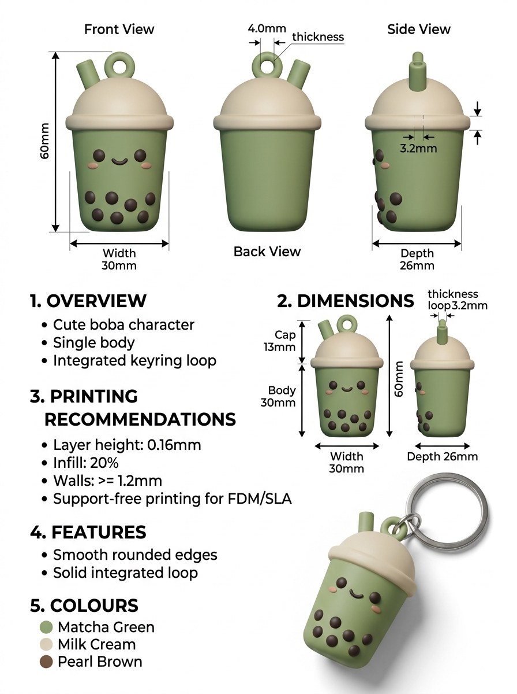

# Printable Roadmap: Intelligent Spec-to-3D Pipeline

This document tracks the architecture, milestones, and infrastructure
history for evolving `printable` from single-photo reconstruction into a
**spec-driven 3D generation and validation pipeline** capable of parsing
engineering infographics and multi-view design sheets.

---

## 1. Problem Statement & Motivation

Generative image-to-3D backends (TripoSR, Hunyuan3D, and similar) expect
clean, unannotated photos of a single subject. Fed a **design
specification sheet** instead (text callouts, dimension arrows,
orthographic front/back/side views, color swatches, keychain mockups),
raw 3D reconstruction fails: text and dimension lines become noisy
geometry, multiple renders fuse into one blob, and explicit physical
constraints (an exact 60mm height, a 4mm loop hole) are ignored.

A local **Vision-Language Model (VLM)** preprocessor addresses this:
understand the design intent, crop clean views, extract physical
constraints into structured metadata, and enforce those rules during
generation and slicer validation.

---

## 2. System Architecture

```
                                [ Design Spec Sheet ]
                                         │
                                         ▼
                 ┌───────────────────────────────────────────────┐
                 │  Stage 1: VLM Extraction (Qwen3.8-27B, via     │
                 │  resident llama-server-rocm's HTTP API)        │
                 │   - Metadata: dimensions + print constraints   │
                 │   - Per-view bounding box detection            │
                 └───────────────────────┬───────────────────────┘
                                         │
                         ┌───────────────┴──────────────┐
                         ▼                              ▼
             [ interim/design_spec.json ]   [ interim/cropped_views/ ]
             - Target dimensions (X/Y/Z mm) - front_clean.png
             - Wall thickness, loop sizes   - side_clean.png
             - Infill / layer height specs  - back_clean.png
                         │                              │
                         └───────────────┬──────────────┘
                                         ▼
                 ┌───────────────────────────────────────────────┐
                 │   Stage 2: Constraint-Driven 3D Generation    │
                 │   - Per-view candidates (Hunyuan3D / TripoSR) │
                 │   - Automated CLI param injection (--size...) │
                 └───────────────────────┬───────────────────────┘
                                         │
                                         ▼
                 ┌───────────────────────────────────────────────┐
                 │   Stage 3: Repair & Verification Gate         │
                 │   - Watertight repair + manifold check        │
                 │   - Spec tolerance check (target mm vs actual)│
                 │   - Keyring loop hole passability check       │
                 └───────────────────────┬───────────────────────┘
                                         │
                                         ▼
                               [ Validated STL File ]
```

---

## 3. Milestones & Phases

### Phase 1: Local VLM Integration — built

Three model/stack combinations were tried, in order, before landing on
the current one (full story in the project's own blog post, "Vision-
Language Models: What They're Actually Good At"):

1. **Qwen2.5-VL-7B-Instruct via `llama-server-rocm` (GGUF)** — blocked by
   a ROCm/HIP FP16 matmul bug that garbles any image input on this chip
   ([ggml-org/llama.cpp#17797](https://github.com/ggml-org/llama.cpp/issues/17797)).
2. **Qwen2.5-VL-7B-Instruct via `transformers`/PyTorch** — sidesteps that
   bug (a different compute stack). What `~/vlm-server/` was originally
   built around.
3. **Qwen3.8-27B via `llama-server-rocm`'s HTTP API** — what's running
   today. Switched because Qwen2.5-VL's multi-view bounding-box
   extraction hit a separate, upstream-documented drift bug
   ([QwenLM/Qwen2.5-VL#1257](https://github.com/QwenLM/Qwen2.5-VL/issues/1257)):
   correct box for the first requested region, drift onto unrelated
   content for the rest.

**Current shape**: `~/vlm-server/` (outside this repo, machine-specific —
see README.md's "Design spec sheets" section) is a FastAPI wrapper
exposing `GET /health`, `POST /extract` (the `design_spec.json` shape
below), and `POST /classify` (powers `printable serve`'s Auto-detect).
Extraction is a metadata call plus one bounding-box call per named view,
each with a repair retry (feed the model its own bad output, ask it to
fix it, sampling enabled).

- **Spec Parser**: standardized JSON schema for design sheets — bounding
  box dimensions, sub-component callouts, slicer recommendations. Built
  and stable, matches §4's target spec below.

### Phase 2: Interim Asset Pipeline & View Isolation — built

- **Intelligent Crop & Masking**: isolates clean subject renders from the
  spec image using VLM bounding boxes, cutting away text and dimension
  arrows.
- **Interim Export**: writes `interim/design_spec.json` +
  `interim/<name>.png` per view for inspection before 3D meshing.
- ~~**Turnaround Synthesizer**~~ — dropped, not built. Feeding a
  synthesized multi-view composite to a single-image backend recreates
  the "reconstructed as one mass" problem `--sheet` exists to avoid.
  Generating from each isolated view separately and picking by real
  validation results — the same approach `--sheet` uses — works better.

`printable generate-spec <sheet.jpg> -b <backend>` calls the Phase 1 VLM
server, writes the interim files above (cropping lives in
`src/printable/backends/sheet.py`'s `crop_views()`, alongside
`split_sheet`/`pick_best_panel`), generates from every cropped view, and
keeps whichever result is actually most printable — identical scoring to
`--sheet` (`0 if printable else 1, bodies_count`).

### Phase 3: Constraint Injection & Dimensional Verification — built

`design_spec.json` maps directly into `PrintSettings`:
`dimensions_mm.total_height` → `--size`, `print_constraints.
min_wall_thickness_mm` → `--min-wall` (both overridable via their own
flags). `printable.pipeline.validate.check_dimension_targets()` compares
the finished mesh's *sorted* extents against the spec's sorted
`total_height`/`width`/`depth` targets — sorted rather than axis-matched,
since `auto_orient` picks final orientation by support cost, not by a
sheet's own axis labels, so there's no reliable per-axis correspondence
to check directly.

A real run against `keychain_boba_spec.jpg` (`-b triposr`) caught exactly
the issue this check exists for: all three cropped views came back
individually watertight/1-body/PRINTABLE, but the winning mesh's other
two extents were 71% and 34% off the spec's targets — TripoSR's
single-view reconstruction invented bulk the sheet's own callouts don't
support, the same "AI backends infer the whole shape from one image"
caveat `--sheet` already warns about, now caught automatically instead of
silently shipped. Not yet built: a keyring-loop-hole-specifically-hollow
check (needs a feature-localized check, not just overall bounding
dimensions).

`generate-spec` is extraction-only — sheet → `design_spec.json` +
`interim/<name>.png` view crops, no generation, no backend needed.
Generation itself lives in `printable generate`, via `--spec <path>`
(fills `--size`/`--min-wall` from the spec, runs the check above) and
`--spec-all-views` (tries every extracted view, keeps the best — same
`_pick_best`/scoring as `--sheet`, sourcing candidates from the spec's
crops). Splitting extraction from generation this way means changing
`-b` or retrying one view doesn't re-hit the VLM, and `generate --spec`
reuses every existing `generate` flag (`--rotate`, `--hollow`,
`--max-faces`, ...) instead of a third near-duplicate arg parser.

### Phase 4: Web UI Enhancements (`printable serve`) — built, with known limits

- **Spec Sheet Mode / Turnaround Sheet Mode** toggles: the design-spec
  flow (`/api/jobs/spec`) and `--sheet`'s grid-split-and-pick-best
  (`/api/jobs/sheet`) are separate, explicit modes, not one auto-guessed
  path — added after Auto-detect's VLM classification misrouted a
  turnaround sheet as a design spec sheet (both are multi-view layouts,
  an easy VLM mix-up), silently producing however many views `/extract`
  named instead of the deterministic grid split.
- **Shared GLB-export fix**: any pipeline that generates several
  candidates before picking a winner calls `run()` with
  `output_path=None` per candidate, which meant `run()`'s own GLB-export
  logic (gated on `output_path is not None`) never fired for any of them
  — true for both `/api/jobs/auto`'s sheet route and `/api/jobs/spec`,
  independently of the same bug in the CLI's own `--sheet`/
  `--spec-all-views`. Fixed once, for all call sites, via a shared
  `pipeline.run.export_winner()`.
- **Review-before-generate** (2026-09-01): spec-sheet jobs now pause in a
  new `awaiting_confirmation` state right after extraction, serving each
  named view's crop via `GET /api/jobs/{id}/view/{name}` for a review
  panel, before `POST /api/jobs/{id}/confirm` resumes into generation
  from those exact crops — no re-extraction. Built after two independent
  VLM grounding bugs kept surfacing on real sheets even with a
  box-size-plausibility check in place: a box landing in the *gap*
  between two renders (caught by a new `check_box_not_clipping()`), and
  one sheet (`keychain_boba_spec.jpg`) still failing outright (502) even
  with both checks and a raised retry budget. Dimension *tweaking*
  (editing extracted numbers, not just viewing crops) isn't built.
- **Known limit** (2026-09-02): the review panel only helps when
  extraction succeeds with a bad crop — it has nothing to show when
  extraction fails outright, which `keychain_boba_spec.jpg` still does
  through the web UI. For a sheet like that, the working path is the CLI
  escape hatch README.md's "Design spec sheets" section documents:
  bypass the VLM entirely, hand-edit `design_spec.json`'s `box_2d` boxes,
  let `generate --spec` read the crops straight off disk. Deliberately
  not building a web-UI equivalent (upload-your-own-spec) for this — more
  surface area than a rare failure mode justifies.

---

## 4. Benchmark Example: Matcha Boba Keychain

A sample design specification sheet is located at `assets/examples/keychain_boba_spec.jpg`.



### Target Extracted Spec (`interim/design_spec.json`)
```json
{
  "title": "Matcha Boba Cup Keychain",
  "dimensions_mm": {
    "total_height": 60.0,
    "width": 30.0,
    "depth": 26.0,
    "cap_height": 13.0,
    "body_height": 30.0,
    "keyring_loop_inner_diameter": 4.0,
    "keyring_loop_thickness": 3.2
  },
  "print_constraints": {
    "layer_height_mm": 0.16,
    "infill_pct": 20,
    "min_wall_thickness_mm": 1.2,
    "supports_required": false,
    "single_body": true
  },
  "views": {
    "front": { "box_2d": [78, 95, 360, 340] },
    "back": { "box_2d": [78, 410, 360, 625] },
    "side": { "box_2d": [78, 700, 360, 915] }
  }
}
```

### Derived Pipeline Invocation

What the target spec above maps to today (`hunyuan3d` or `triposr` — not
`trellis`, dropped as a backend for consistently fragmenting into
disconnected, unprintable bodies, see `src/printable/backends/ai.py`'s
module docstring):

```bash
printable generate-spec assets/examples/keychain_boba_spec.jpg
printable generate --spec interim/design_spec.json --spec-all-views -b hunyuan3d \
  --min-wall 1.2 --no-base
```

## 5. Known Limitations (Unscheduled)

### Auto-orient could land a character mesh on its head — fixed

`prep.py`'s `auto_orient()` picks whichever of several axis-aligned
rotations gives the most flat bed contact minus overhang — a pure
print-optimization score with no semantic understanding of the mesh. For
a humanoid figure, lying on its back/front could beat standing on its
feet, since feet present far less flat contact area than a torso.
Confirmed on a real TripoSR output landing head-down, watertight and
otherwise correctly `PRINTABLE`.

Couldn't be fixed by rotating the finished STL in a slicer — `prepare()`
adds the base plate *after* `auto_orient()`/`seat_on_bed()`, fusing it to
whatever face ends up on the bottom. `--rotate X Y Z` (applied after
auto-orient, before the base) exists as a manual override for this case.

**Fix**: dropped the two 180°-about-X/Y candidates from the search — the
ones that swap top for bottom while keeping the same footprint/height
shape. With those removed, upright now beats every remaining candidate on
the reproducing mesh, and a regenerated run stands correctly with no
`--rotate` needed. A blanket "prefer tall orientations" bias was
considered and rejected instead — it would regress objects that
genuinely should lie on their side (a thin pillar); excluding only the
top/bottom-swap candidates can only make identity orientation *more*
likely to win, never less, so it's safe for cases where identity was
already correct. Regression test:
`tests/test_pipeline.py::test_auto_orient_does_not_stand_a_character_on_its_head`.
Verified on a second, independent case too (`figure.jpg` via
`hunyuan3d`, stands correctly with no `--rotate`).

A backend output that's itself genuinely upside-down would still regress
under this fix, but hasn't been observed in practice; `--rotate 180 0 0`
remains available if one turns up.

**Separate, still-unaddressed finding from the same investigation**:
`validate()` alone can OOM-kill the process on a very high-face-count raw
mesh (~400k faces observed) even with `--skip-repair` set — worth
investigating what in that check is memory-heavy enough to exhaust
122GB, independent of the decimation/Poisson issue below.

### `--rotate` is a blind delta — check the unrotated result first

`--rotate` doesn't know or check whether the mesh already came out right,
so applying it speculatively — guessing a fix before looking — is a coin
flip, not a correction. Confirmed by a real case: a guessed `--rotate 180
0 0` flipped an already-correctly-oriented `--sheet` panel upside down;
the same panel, regenerated with no `--rotate`, was already standing
correctly on its own. Auto-orient scores differing across `--sheet`
panels don't reliably indicate which are upside down either — they
reflect base-contact/overhang tradeoffs (pose variation) that vary even
among correctly-oriented results.

Always inspect the unrotated result first (`--keep-all` for `--sheet`
mode, or just open the STL for a normal run), and only add `--rotate` —
tailored to what you actually see — if it's actually needed.

Still true and unfixed: `_cmd_generate_sheet`'s `score()` (`cli/main.py`)
ranks candidates only by `(printable, bodies)`, with no orientation
awareness — when panels tie on both (common), `min()` silently keeps
whichever came first. Not the root cause of the case above, but an
orientation-aware tiebreak would help eventually.

### Decimation can damage an already-good mesh badly enough Poisson rebuild can't recover it

Confirmed on a real `hunyuan3d` run (`figure.jpg`, `--size 80 --hollow`):
the raw 409,130-face mesh was already watertight and consistently wound
— genuinely clean — but exceeded the default `--max-faces 300000` cap,
so quadric decimation ran and introduced non-manifold edges
`fill_holes()` couldn't fully close. That correctly triggered escalation
to Poisson rebuild, which then made things *worse*: `watertight=False`,
11 disconnected islands, a `divide by zero` warning in trimesh's own
volume computation suggesting a degenerate region fed into it. Final
output: `NOT PRINTABLE`.

**Workaround**: raise `--max-faces` above the backend's raw output count
so decimation is skipped entirely (confirmed fixes it — `--max-faces
500000` on the example above). **Real fix** needs more investigation —
the escalation logic itself is correctly guarded; the actual bug is that
`poisson_rebuild()` can produce a non-watertight, heavily fragmented
result on input decimation only lightly perturbed. Not attempted here.

---

## 6. Infrastructure History

Kept for reference if similar issues resurface — not active work.

### ROCm 10.0 migration (2026-08-29 to 2026-08-31)

AMD announced ROCm 10.0 on 2026-08-27. This box was on ROCm 7.13 (a
TheRock gfx1151-native nightly) until this migration.

**2026-08-29, tried and reverted**: TheRock's *nightly* index pulled a
same-day `10.1.0a20260829` build where torch worked but rebuilding
`torchmcubes` failed inside `LoadHIP.cmake` (`HIP_VERSION_MAJOR`/`MINOR`
came back empty from TheRock's new split `hip-lang`/`hip` CMake
packages). Reverted to 7.13 at the time.

**2026-08-31, migrated for real**, via a different, *stable* channel
instead (`stable.repo.amd.com/rocm/whl-next/`, distinct URL from the
nightly one above) — this is what `docs/SETUP.md` documents. Pin:
`torch==2.13.0+rocm10.0.0`. `torchmcubes` builds cleanly against it.
Confirmed via the full test suite and real `triposr`/`hunyuan3d`
generation — all `PRINTABLE`. Flash/mem-efficient attention now works
**unflagged** (`TORCH_ROCM_AOTRITON_ENABLE_EXPERIMENTAL=1` no longer
required, harmless if still set).

**Unexpected bonus**: Hunyuan3D texture painting's GPU page-fault crash
(`docs/SETUP.md`'s Texture painting section) stopped reproducing on this
stack — two independent full paint-pipeline runs, clean both times, no
fault/reset/timeout in the kernel log. Never root-caused at the kernel
level, so whether it's actually fixed upstream or just not triggered by
this build is unknown. Same day, `hy3dpaint` was wired into `ai.py` for
real — `Hunyuan3DBackend` now reads `--opt texture=true` and writes a
PBR-textured preview GLB alongside the STL (`GenerationResult` gained a
`color_mesh` field, since the painted mesh has different topology from
the shape mesh) — needing two more environment-drift fixes beyond the
six already in `docs/SETUP.md`'s Texture painting section.

**Two unrelated regressions found and fixed along the way**:
- Rebuilding `torchmcubes` via `uv pip install
  --no-build-isolation-package torchmcubes git+...` without `--no-cache`
  silently reused a `.so` built against the *old* torch — `uv`'s build
  cache for `git+` sources keys on source commit, not on
  `CMAKE_ARGS`/`ROCM_PATH`. Symptom: a confusing `RuntimeError: vol must
  be a CPU tensor` on a tensor that actually was already CPU-side, not a
  real bug in `torchmcubes`' own (correct) device check. `docs/SETUP.md`
  now calls out `--no-cache` explicitly wherever this rebuild appears.
- `pymeshlab` was removed on 2026-08-29 on the mistaken conclusion it was
  an unused stray dependency. It's a real, untracked-by-pip-metadata
  dependency of `hy3dshape/postprocessors.py` (`hy3dshape`'s `setup.py`
  declares no dependencies at all) — removing it silently broke the
  `hunyuan3d` backend. Reinstalling brought back an interpreter-
  finalization SIGABRT from pymeshlab's bundled Qt runtime, now 100%
  reproducible. Real fix: `tests/conftest.py`'s `pytest_unconfigure` hook
  now flushes output and calls `os._exit()` with the real exit status
  before CPython finalization reaches it — verified a deliberately
  failing test still exits nonzero, not laundered to 0.

### OOM crashes: three unrelated root causes (2026-08-29)

Not one bug — three, that happened to produce the same symptom:

1. **Orphaned duplicate `llama-server-rocm` processes** accumulating
   ~9GB of dead memory over repeated relaunches. Fixed by killing them.
2. **`--ctx-size` oversized on the VLM server**: `--ctx-size 262144`
   pre-allocates its KV cache for a quarter-million tokens regardless of
   actual use; real usage here never exceeds ~13,500 tokens per call —
   roughly 19x smaller. Dropped to `--ctx-size 32768`. Confirmed fix: a
   `figure_medusa_scale_statue.jpg` auto-detect run that previously
   OOM'd now completes end to end. Current recommended launch command:
   ```bash
   llama-server-rocm \
     --model ~/models/Qwen3.8-27B-Q4_K_M.gguf \
     --mmproj ~/models/mmproj-Qwen3.8-27B-f16.gguf \
     --alias qwen3.8-27b \
     --n-gpu-layers 99 \
     --ctx-size 32768 \
     --parallel 1 \
     --flash-attn on \
     --jinja \
     --temp 0.7 --top-p 0.8 --top-k 20 --min-p 0 \
     --spec-type draft-mtp --spec-draft-n-max 2 \
     --kv-unified --fit off \
     --image-min-tokens 1024 \
     --host 0.0.0.0 --port 8080
   ```
3. **`BackendRegistry.get()` reloaded its model on every call**,
   including repeated calls to the same backend within one
   `--sheet`/`--spec-all-views` loop — a genuine ~110s reload each time,
   not a warm-cache hit, eventually OOMing on the third generation in a
   long-lived `printable serve` process. Fixed by caching instances per
   backend name, invalidated only if the factory itself changes (a test
   that swaps in a fake backend via `monkeypatch.setitem` still gets a
   fresh instance, not a stale cached one).

**Separately investigated, not applied**: an upstream llama.cpp bug
([ggml-org/llama.cpp#22867](https://github.com/ggml-org/llama.cpp/issues/22867))
means MTP speculative decoding (`--spec-type mtp`) combined with vision
input can cause an infinite retry loop exhausting memory — the launch
command above uses exactly that flag combination. **Decision: leave MTP
enabled.** It was never confirmed as the actual cause of any crash here
(all three above had independent, already-fixed explanations), and
disabling it roughly halves throughput (~20 tok/s → <10 tok/s on this
box). Revisit only if a future crash happens with `ps` confirmed clean of
orphaned processes.

### lemonade-sdk evaluated as a `llama-server-rocm` replacement (2026-08-28) — not adopted

[lemonade-sdk/lemonade](https://github.com/lemonade-sdk/lemonade) is an
actively maintained local inference server targeting Strix Halo/gfx1151
directly, with its own maintained ROCm llama.cpp fork
([lemonade-sdk/llamacpp-rocm](https://github.com/lemonade-sdk/llamacpp-rocm)).
Evaluated as a possible replacement for hand-running `llama-server-rocm`.

**Verdict: not adopted.** Its vision support is still llama.cpp's own
`--mmproj` mechanism under the hood — same engine, so it wouldn't
sidestep the MTP+vision bug above — and its own issue tracker has open
reports of the ROCm build being rough on Strix Halo specifically
(`lemonade#2624`, `llamacpp-rocm#60`). More concretely: `lemonade run` on
its own suggested, featured model+recipe for this use case
(`Qwen3.8-27B-GGUF`) failed outright on this hardware's `llamacpp:rocm`
backend — `missing tensor 'blk.64.ssm_conv1d.weight'` (Qwen3.8-27B is a
hybrid SSM/Mamba + attention architecture; this GGUF variant is missing a
tensor an SSM layer needs). Verified this wasn't a pull mistake — file
size matched HF's authoritative source exactly, and the checkpoint+recipe
combination matches Lemonade's own `server_models.json` precisely, so
it's genuinely what they recommend, not a local misconfiguration. Not yet
filed upstream.

Whatever value Lemonade offers (unified server management, a model
catalog, AMD-tuned defaults instead of hand-deriving flags) is
convenience, not a fix for a correctness problem already present in the
shared llama.cpp engine. Parked — the existing hand-run
`llama-server-rocm` setup keeps working and isn't being touched. Revisit
if a future release fixes this model's ROCm loading, or the upstream MTP
bug gets resolved.

### Trellis2 / Pixal3D evaluated as image-to-3D backends (2026-09-15) — rejected

Re-evaluated now that newer ROCm builds finally support gfx1151 cleanly,
since that's what made TRELLIS v1/SPAR3D unworkable to even properly test
before. Not the original TRELLIS repo (needs hipify-porting custom CUDA
kernels) — ComfyUI's native `Trellis2`/`Pixal3D` nodes, a from-scratch
pure-PyTorch reimplementation with no custom kernels, run against the
project's bundled `3d_pixal3d_trellis2_image_to_model` workflow template.
Both ran end-to-end cleanly on this hardware (no ROCm/HIP errors, no CPU
fallback) and looked genuinely good rendered — 6m29s and 11m36s
respectively for one test image.

**Rejected on the actual metric that matters here**: extracting each
GLB's raw geometry directly (bypassing `trimesh.load()`'s own GLB
loader — see the memory-safety note below) and checking body count found
Trellis2's output fragmented into **9,602 disconnected bodies** (largest
piece under 10K of 692K total faces) and Pixal3D's into **4,110** (largest
under 21K of 699K total) — only 193 and 10 of those bodies respectively
were even individually watertight. Same failure mode TRELLIS v1 and
SPAR3D were dropped for originally, just measured directly this time
instead of inferred from "looked wrong in practice." Confirms the
underlying issue was never specific to the old TRELLIS v1 codebase or the
old ROCm stack — visually clean, texture-mapped output can still be
topological garbage underneath, and rendering never surfaces that.
`src/printable/backends/ai.py`'s module docstring records the same
finding for a future reader who doesn't need this full writeup.

**Real memory-safety trap, worth knowing if this is ever re-tested**:
`trimesh.load(path, force="scene")` on either GLB — a completely
standard-looking call — consumed 100GB+ of RAM and got OOM-killed twice,
the second time taking the whole desktop session down with it. The actual
mesh data is unremarkable (~65-70MB buffers, ~500K vertices), so this is a
real pathology in trimesh's own GLB-loading path on these specific files,
not a sign the files themselves are huge. Worked around by extracting the
POSITION/indices accessors directly via `pygltflib` and building a bare
`trimesh.Trimesh(vertices=..., faces=..., process=False)` from the raw
arrays instead — never calls trimesh's GLB loader at all. Anyone touching
these files again: run any trimesh-based inspection under a hard memory
ceiling (`ulimit -v`) first, don't assume a "just load the mesh and check
it" script is safe on these specific exports.

Not adopted. No backend code was written for either model.
